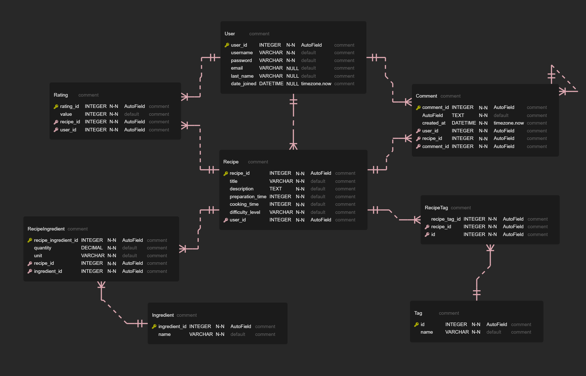

# Recipe Management System

## 목차
- [Recipe Management System](#recipe-management-system)
  - [목차](#목차)
  - [개요](#개요)
  - [기능](#기능)
  - [설치](#설치)
      - [로컬](#로컬)
      - [Docker](#docker)
  - [사용법](#사용법)
  - [사용된 기술](#사용된-기술)
  - [ER 다이어그램](#er-다이어그램)
  - [데모](#데모)
  - [테스트용 데이터 생성](#테스트용-데이터-생성)
  - [추후 과제](#추후-과제)


## 개요
Django와 GraphQL로 구축된 레시피 관리 시스템입니다. 사용자는 레시피를 생성, 조회, 편집 및 삭제할 수 있으며 또한 레시피에 대한 평가 및 특정 기준에 따른 레시피 검색이 가능합니다.

## 기능

- 사용자 인증: 사용자는 회원가입, 로그인 및 로그아웃하여 자신의 레시피를 관리할 수 있습니다.
- 레시피 CRUD 작업: 사용자는 레시피를 생성, 조회, 편집 및 삭제할 수 있습니다.
- 태깅: 레시피에 카테고리를 추가하여 조직 및 필터링이 쉽도록 합니다.
- 평가 시스템: 사용자는 1에서 5까지의 별점으로 레시피를 평가할 수 있습니다.
- 검색 기능: 사용자는 제목, 재료 또는 태그를 기준으로 레시피를 검색할 수 있습니다.

## 설치

**깃허브에서 레포지토리를 클론**

   ```bash
   git clone https://github.com/yehoon17/recipe-management-system.git
   ```

#### 로컬 
1. 필요한 종속성을 설치

   ```bash
   pip install -r requirements.txt
   ```

2. 디렉토리 이동

   ```bash
   cd website
   ```

3. 데이터베이스 마이그레이션을 적용

   ```bash
   python manage.py migrate
   ```

4. 개발 서버를 실행

   ```bash
   python manage.py runserver
   ```

5. 웹 브라우저에서 `http://localhost:8000`에서 응용 프로그램에 액세스

#### Docker
1. 도커 이미지 생성
   ```bash
   docker build -t recipe_management_system .
   ```

2. 도커 컨테이너 실행
   ```bash
   docker run -d -p 8000:8000 recipe_management_system
   ```

3. 웹 브라우저에서 `http://localhost:8000`에서 응용 프로그램에 액세스

## 사용법

- 새 계정을 생성하거나 기존 계정으로 로그인
- 레시피를 찾아보거나 특정 레시피를 검색하거나 태그별로 레시피를 필터링
- 설명, 재료 및 평가를 포함한 레시피 세부 정보를 확인
- 레시피를 평가하고 피드백을 제출
- 새로운 레시피를 만들거나 기존 레시피를 편집하거나 삭제
- 테스트용 데이터 생성

## 사용된 기술

- Django: 애플리케이션을 구축하는 백엔드 프레임워크
- GraphQL: 서버와 상호 작용하고 데이터를 가져오는 질의 언어
- HTML/CSS: 사용자 인터페이스의 프론트엔드 마크업 및 스타일링
- JavaScript: 인터랙티브 기능과 동적 콘텐츠를 위한 클라이언트 측 스크립팅
- SQLite: 레시피 데이터를 저장하는 데이터베이스 관리 시스템
- Git: 변경 사항을 추적하고 다른 사람들과 협업하기 위한 버전 관리 시스템

## ER 다이어그램


## 데모

## 테스트용 데이터 생성 


## 추후 과제


